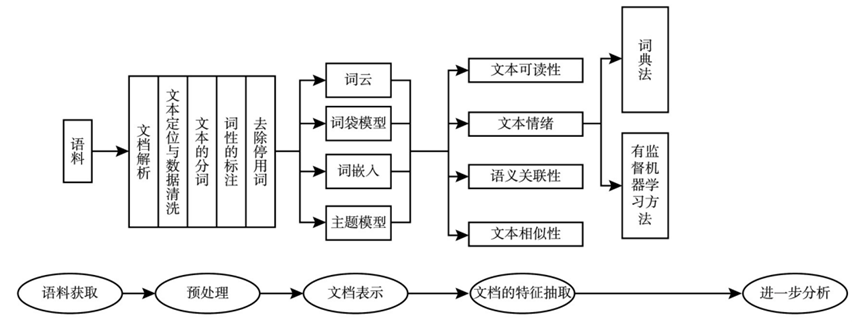
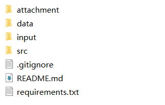

# TextualProcess
## 项目背景

该项目为 金融学文本大数据挖掘方法与研究进展 论文中金融文本大数据的挖掘步骤和方法的实现。论文详细内容参考附件[Survey_ChineseTextualData_Full.pdf](attachment/Survey_ChineseTextualData_Full.pdf)。
## 项目结构
### data目录
程序在运行中产生的数据，包括中间处理产生的数据和训练好的模型文件。包括以下目录和文件：
- annual_report文件夹下是年报的原始文件
- catalogue_removed文件夹下是将目录部分删除掉的年报文件
- md&a文件夹下是从各个年报中提取的MD&A部分
- model文件夹下是训练的LDA和Word2vec模型的缓存文件，其中lda.model为LDA模型的缓存文件，zhiwiki_news.word2vec为Word2vec模型的缓存文件
- all_word.pth、doc_sentences.pth、doc_word.pth三个文件是经过文本预处理（包括分词、去掉停用词）之后的MD&A部分的词语的缓存，all_word.pth是所有词语的列表；doc_word.pth是文档的列表，每个文档内是词语的列表；doc_sentences.pth是文档的列表，每个文档中包含多个句子，每个句子内是词语的列表
- pmc.csv是在文本的特征抽取中的第四部分文本相似性产生的文件，对应计算方式如公式：
		$$PMC=\frac{\sum similarity\ of\ nearest\ N firms}{N}$$
- wordcloud.jpg为程序生成的词云图
### input目录
存放程序的运行所需的输入数据，包括一些词典，停用词，以及爬虫需要使用的公司列表数据等。详细如下：
- other文件夹内存放的是程序运行过程中需要用到的数据文件
	- mask.png是生成词云图要用到的图层遮盖（mask）；
	- simfang.ttf文件是仿宋的字体文件，用来避免生成的词云中的中文文字乱码；
	- stopword.txt是在文本预处理阶段要用到的停用词词典，用来进行停用词的过滤；
	- sentiment_dic.xlsx是特征提取阶段计算文本情绪所要用到的情感词典，來自[金融领域中文情绪词典](https://github.com/dictionaries2020/SentimentDictionaries)
	- 人工智能词典v14.xlsx是特征提取阶段计算文本语义关联性所要用到的人工智能词典；
- zhwiki-20190720-pages-articles-multistream.xml.bz2是用来训练word2vec模型要用到的中文维基百科语料库数据
### src目录
存放项目中相关的代码文件，其中：
- pre_process.ipynb为数据预处理部分的代码文件
- presentation.ipynb为文档表示部分对应的代码文件
- feature_extract.ipynb为特征抽取部分对应的代码文件
- process_func.py存放了分词和过滤相关的函数实现，使用单独的文件是为了在windows下使用multiprocessing来加速处理，如此放置的原因请参考：[https://medium.com/@grvsinghal/speed-up-your-python-code-using-multiprocessing-on-windows-and-jupyter-or-ipython-2714b49d6fac](https://medium.com/@grvsinghal/speed-up-your-python-code-using-multiprocessing-on-windows-and-jupyter-or-ipython-2714b49d6fac)

## 各个程序部分的详细介绍
- 数据的预处理部分：
  代码在pre_process.ipynb文件中。该部分包含年报的MD&A提取以及中文的分词和去掉停用词部分，提取的MD&A部分放在data目录的md&a文件夹中。
- 文档表示：
  代码部分在presentation.ipynb文件中。利用分词后的结果统计词频画出词云图、构造词袋模型、使用预训练的word2vec来将MD&A的内容向量化和使用LDA模型挖掘文本的主题分布。
- 特征提取：
  特征提取部分的代码在feature_extract.ipynb中，包含按照词典法计算文本的情绪指数Tone，文本的可读性分析，文本的语义关联以及文本相似性的计算。

## 项目依赖
运行项目所需的依赖在requirements.txt文件当中，使用`pip install -r requirements.txt`即可安装相应的依赖。

## 数据下载
由于`data`和`input`文件夹内包含的数据文件较大，无法直接上传到github，因此通过百度网盘的方式进行下载，点击链接进行下载：[下载链接](https://pan.baidu.com/s/1XdOFBkFYH6673Vx-z4OtQg?pwd=3lb7)

下载完成后，将其解压，将`data`和`input`文件夹放置到和`src`文件夹相同层级，如下图：

